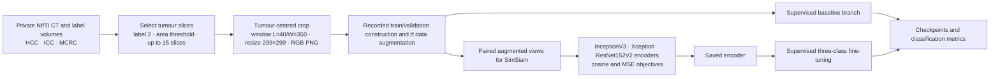

# SimSiam for Primary and Secondary Liver Cancer Classification

[](https://doi.org/10.1007/978-3-031-47425-5_28)

Research code snapshot accompanying:

> Ramtin Mojtahedi, Mohammad Hamghalam, William R. Jarnagin, Richard K. G. Do, and Amber L. Simpson. “Leveraging Contrastive Learning with SimSiam for the Classification of Primary and Secondary Liver Cancers.” *MICCAI 2023 Workshops*, LNCS 14394, 311–321 (2023). [https://doi.org/10.1007/978-3-031-47425-5_28](https://doi.org/10.1007/978-3-031-47425-5_28)

<!-- repository-guide:start -->
## At a glance

[Paper](https://doi.org/10.1007/978-3-031-47425-5_28) · [`Simsiam.py`](Simsiam.py) · [`requirements.txt`](requirements.txt) · [`CITATION.cff`](CITATION.cff)

### Dependency evidence

| Status | Packages |
|---|---|
| Declared and imported | `numpy`, `nibabel`, `scikit-image`, `tqdm`, `opencv-python`, `scikit-learn` |
| Imported but missing from `requirements.txt` | `tensorflow`, `imbalanced-learn`, `matplotlib` |
| Declared without a matching third-party import | `regex`; the export imports Python's standard-library `re` module |

The historical notebook command for `tensorflow-gpu==2.5.0` and its older mixed-precision API are not a tested modern environment specification.

### Workflow represented by the export



> **Reproducibility boundary:** the export contains multiple dataset-construction paths, notebook-only syntax, absolute paths, and missing data and weights. Establish one documented patient-level split and a tested TensorFlow environment before reuse.
<!-- repository-guide:end -->

## Repository status

This repository is an archival research snapshot, not a packaged or end-to-end reproducible software release. It preserves the main experimental workflow exported from the original Google Colab notebook. The snapshot does **not** include the clinical CT data, segmentation labels, trained model weights, fixed data splits, or standalone `train.py` and `evaluate.py` programs.

`Simsiam.py` cannot be run unchanged as a normal Python script. It contains notebook-only syntax, hard-coded institutional storage paths, and assumptions about the original research environment. The dependency list is also incomplete relative to the imports in the script. See [Preparing the snapshot](#preparing-the-snapshot) before attempting to use it.

## Study overview

The study evaluates SimSiam self-supervised pretraining for three-class liver tumour classification from CT-derived tumour images. InceptionV3, Xception, and ResNet152V2 backbones are explored with cosine-similarity and mean-squared-error objectives, followed by supervised fine-tuning.

The paper reports the study cohort, experimental design, and results. The code is supplied to make the implementation easier to inspect; it should not be treated as a validated clinical system.

## What is included

| Path | Contents |
| --- | --- |
| `Simsiam.py` | A Python export of the original Colab workflow, including image preparation, dataset construction, baseline training, SimSiam pretraining, and fine-tuning sections. |
| `requirements.txt` | A partial list of packages used by the workflow. |
| `CITATION.cff` | Machine-readable repository and preferred paper citation metadata. |

No patient images, labels, trained checkpoints, or generated tumour slices are included.

## Getting the snapshot

```bash
git clone https://github.com/Ramtin-Mojtahedi/SimSiam-LiverCancer-CL.git
cd SimSiam-LiverCancer-CL
```

Installing `requirements.txt` alone is not sufficient to recreate the original environment:

```bash
python -m pip install -r requirements.txt
```

The script additionally imports TensorFlow/Keras, imbalanced-learn, and Matplotlib. It also includes a notebook command requesting the legacy `tensorflow-gpu==2.5.0` package and uses an older mixed-precision API. No tested Python, CUDA, TensorFlow, or package-version matrix is supplied in this snapshot.

## Preparing the snapshot

Before attempting an experiment:

1. Obtain appropriately authorized imaging and label data. The repository does not distribute the study data or grant access to it.
2. Create and document a compatible environment. Treat `requirements.txt` as a starting inventory, not a complete lock file.
3. Open the workflow in a notebook environment or split it into scripts. Remove or replace the `!pip install ...` notebook command before running it as Python.
4. Replace every `/mnt/largedrive0/...` input, output, and checkpoint path with paths for your environment.
5. Review the expected image/label naming conventions and the HCC, ICC, and MCRC class definitions before constructing a dataset.
6. Verify patient-level splitting, preprocessing, normalization, augmentation, checkpoint loading, and evaluation logic for your intended use.

Because data manifests, environment pins, and trained weights are absent, reproducing the paper results from this snapshot alone is not currently possible.

## Data access, privacy, and governance

The study used clinical CT images and corresponding annotations. These data are not stored in this repository. Any access or reuse must follow the applicable institutional approvals, consent or waiver conditions, data-use agreements, privacy requirements, and secure-computing rules. Contact the authors through the published paper or open a repository issue to ask about data-access procedures; access cannot be assumed or guaranteed.

Do not upload patient data, protected health information, credentials, or private storage paths in an issue or pull request.

## Results and intended use

Refer to the [published paper](https://doi.org/10.1007/978-3-031-47425-5_28) for the evaluated methods and reported results. This code is provided for research inspection and method development only. It has not been validated for diagnosis, treatment selection, or other clinical decision-making.

## Citation

If this repository supports your work, cite the paper rather than only the GitHub URL. GitHub and citation managers can also read [`CITATION.cff`](CITATION.cff).

```bibtex
@inproceedings{mojtahedi2023leveraging,
  author    = {Mojtahedi, Ramtin and Hamghalam, Mohammad and Jarnagin, William R. and Do, Richard K. G. and Simpson, Amber L.},
  title     = {Leveraging Contrastive Learning with SimSiam for the Classification of Primary and Secondary Liver Cancers},
  booktitle = {Medical Image Computing and Computer Assisted Intervention -- MICCAI 2023 Workshops},
  series    = {Lecture Notes in Computer Science},
  volume    = {14394},
  pages     = {311--321},
  year      = {2023},
  publisher = {Springer},
  doi       = {10.1007/978-3-031-47425-5_28}
}
```

## License and reuse

No software license has been declared for this repository. Public visibility of the source does not by itself grant permission to copy, modify, redistribute, or incorporate it into another project. Contact the authors and any other relevant rightsholders before reuse. The citation metadata in `CITATION.cff` is provided for attribution and does not create a license grant.

## Questions and contributions

Please use [GitHub issues](https://github.com/Ramtin-Mojtahedi/SimSiam-LiverCancer-CL/issues) for questions about the code or documentation. Do not include sensitive data in public discussions. Proposed documentation and portability improvements are welcome, subject to the repository's current no-license status.
